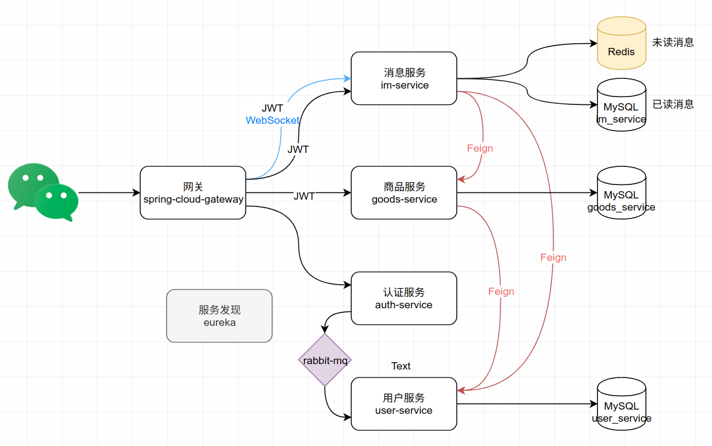
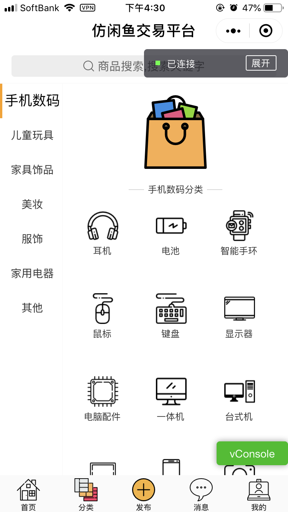
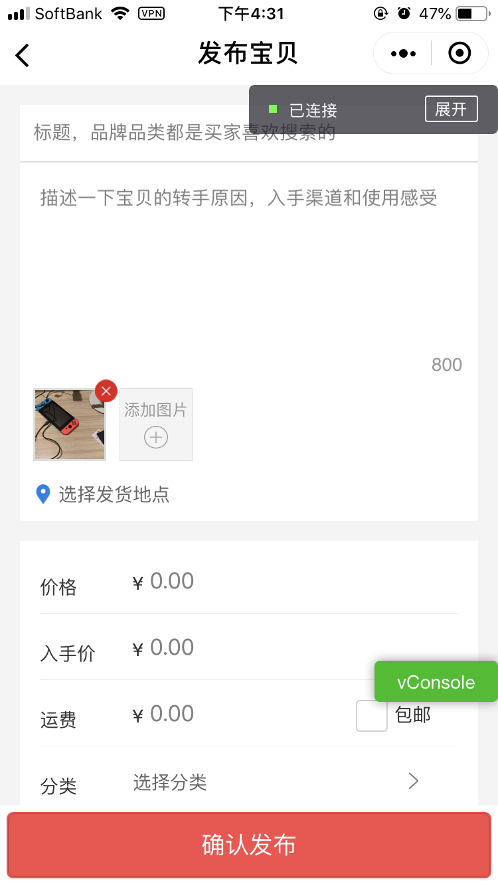
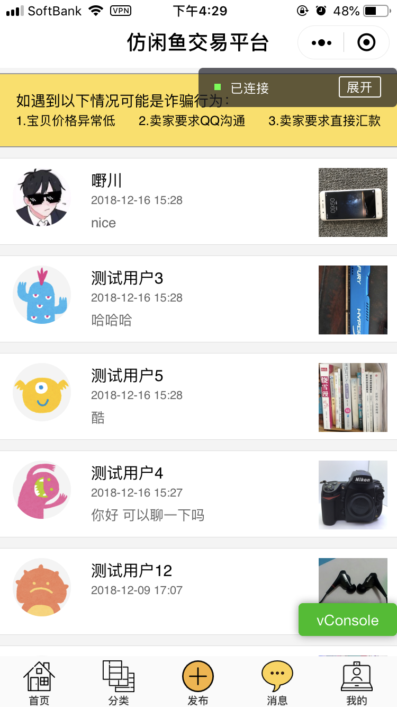
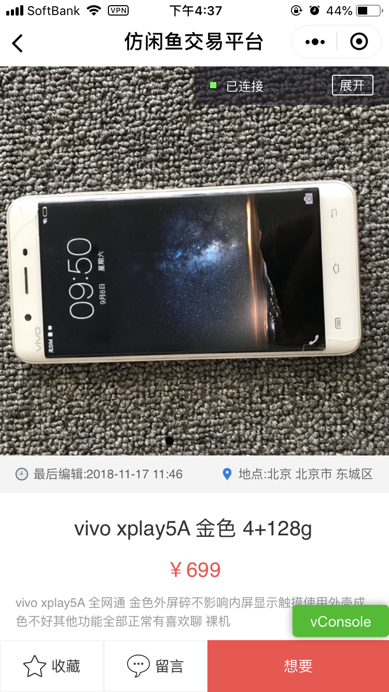
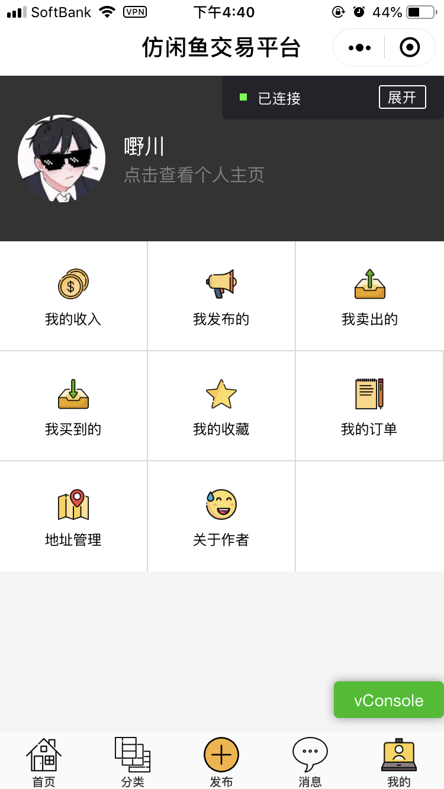
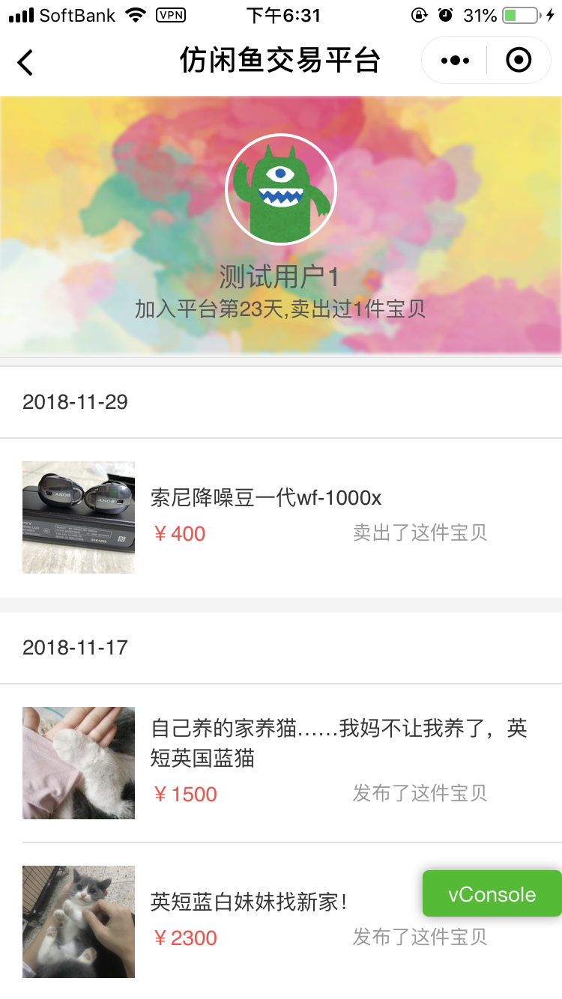
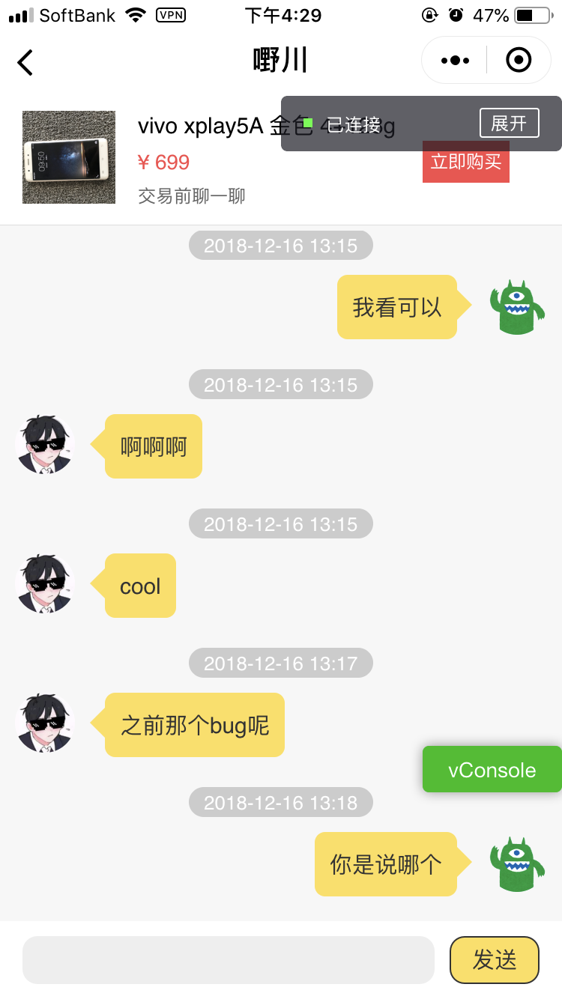
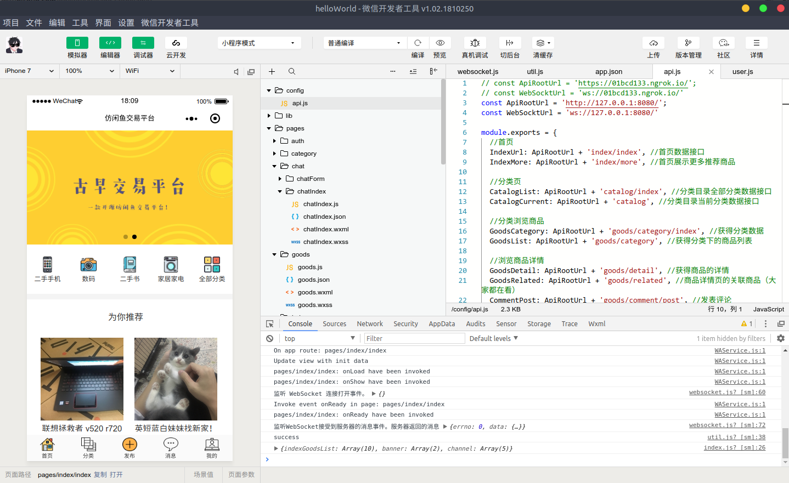

# 🌀 功能
- 首页 : 广告banner,推荐分类,推荐商品
- 分类功能 : 2级分类,分类浏览商品
- 搜索功能 : 关键字搜索,搜索历史,热门关键字,搜索辅助,
- 浏览商品详情 :  商品信息,2级评论,卖家信息,相关商品,标记为收藏,标记为想要
- 发布商品 : 上传商品图,发货地点,支持多种交易方式
- 聊天功能 : 基于WebSocket,标记为想要后创建对话(模仿闲鱼),在聊天框中下单(模仿闲鱼)
- 其他功能 : 用户主页,查看自己发布,收藏,卖出,买到的商品


# 🖇 后端服务拆分

后端基于Spring Cloud搭建,拆分为`认证`,`用户`,`消息`,`商品`,`服务发现`,`网关`6个服务




# 🗺 预览

<p align="center">
    
    
    
    
    
    
    
</p>

# 🚀 快速开始

## 前端

然而并不能快速开始，首先你得有小程序的appid。需要先申请小程序账号和下载小程序开发工具，步骤可以参考[官方教程](https://developers.weixin.qq.com/miniprogram/dev/)。注册完成后会拿到appid和secret，在`auth-service/src/main/resources/application.yml`中配置你的appid和secret。

```yml
#写入你的小程序信息
wx:
  miniapp:
    appid:  #微信小程序的appid
    secret: #微信小程序的Secret
    msgDataFormat: JSON
```

打开刚下载好的小程序开发工具，创建一个新项目。然后把[wx-front](https://github.com/nnkwrik/fangxianyu/tree/master/wx-front)中的所有文件覆盖到你刚创建的小程序项目目录中。由于小程序默认服务端只能是HTTPS并且是ICP备案过的域名，不方便开发，在小程序开发工具的`设置/项目设置`中把`不校验合法域名、web-view（业务域名）、TLS 版本以及 HTTPS 证书`勾上。

## 后端


部署完成后稍等片刻（网关完全启动比较耗时），打开你的小程序开发工具，点击上方的`编译`就可以看到首页了。



## 真机调试

因为现在域名用的是localhost，手机是访问不到的，需要内网穿透。我在dev/ngrok/下放了linux版本的ngrok，如果你也是linux系统，直接运行里面的目录下的`start.sh`就行了，别的系统的话去谷歌找一下.. 随后会得到一个随机的域名（websocket通用），把它配置到小程序前端的config/api.js下，替换原来的localhost:8080。然后点`真机调试`就能通过手机访问到服务端了。


# 🐢 非docker-compose部署

不想用docker-compose就只能一步步来了。

- 先启动3个基础服务。运行`dev/mysql`,`dev/redis`,`dev/rebbitmq`目录下的`start.sh`。

- 把6个服务（`auth-service`,`goods-service`,`user-service`,`im-service`,`eureka`,`gateway`）下Application启动类跑起来。

其他和快速开始一样


# 📡 端口

### 非docker-compose环境下

- MySQL : 3306
- Redis ： 6379
- Rabbit MQ ： 5672 （管理界面：15672）
- gateway ： 8080
- eureka ：8801
- user-service ： 8802
- auth-service ： 8803
- goods-service ：8804
- im-service ：8805


# 🔑 关于JWT

后端API基于Header中的JWT Token进行认证。如果你还不了解JWT的话可以先了解下，微服务认证的神器。

controller中通过@JWT注解把Token进行认证后转成JWTUser类。具体参考各个controller中的代码。

我使用的时对称加密：即自己指定一个密钥secret，然后通过SHA256加密，生成token，然后传给前端，解密也是用自己的密钥secret
